# Introduction

## The importance of workflows

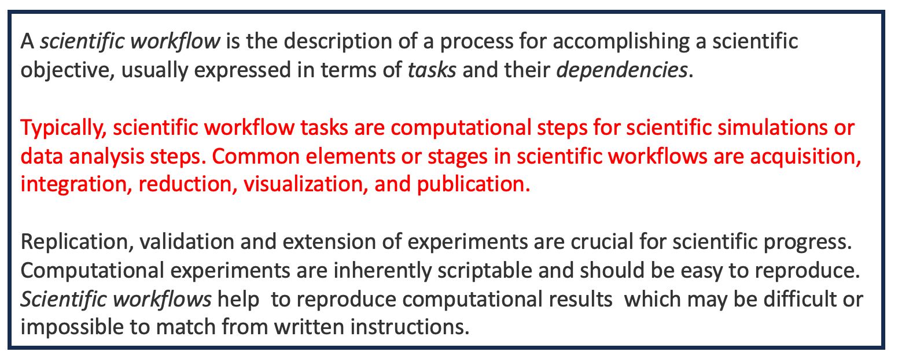

## The importance of documentation

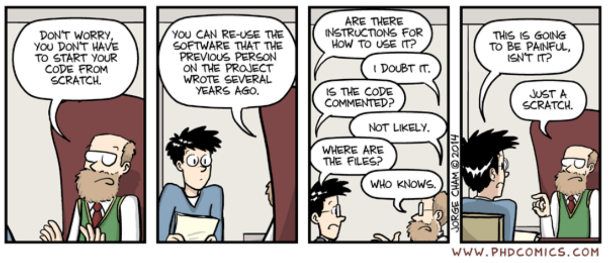

# Workflow samples

## Generic workflow

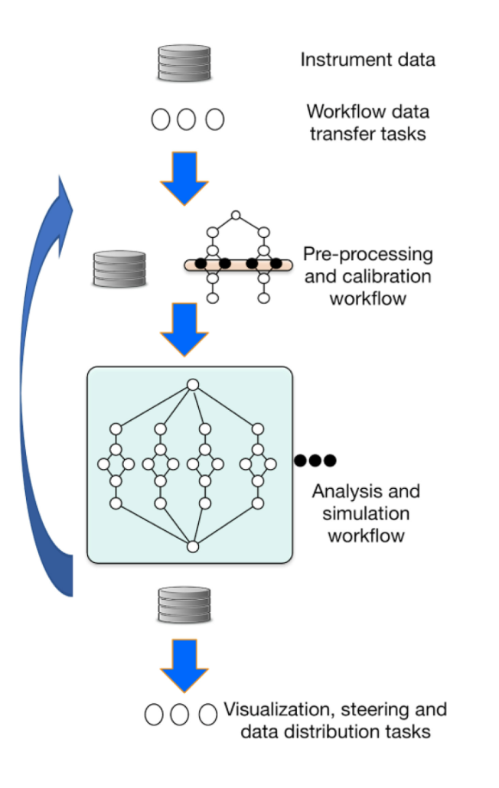

## A SAR workflow

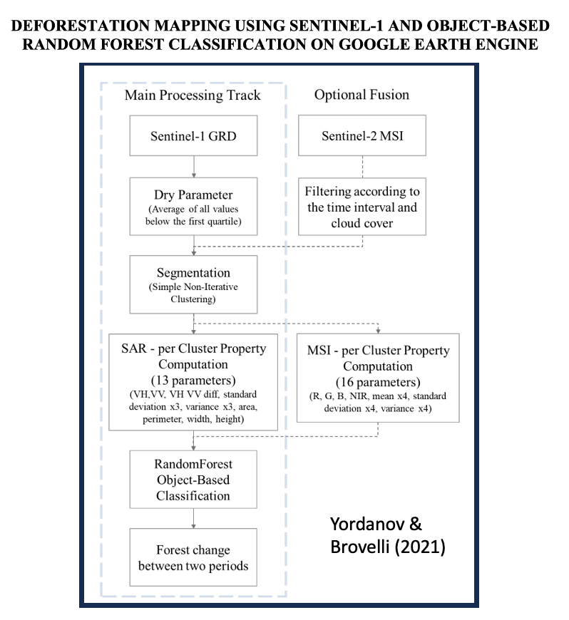

## Another workflow

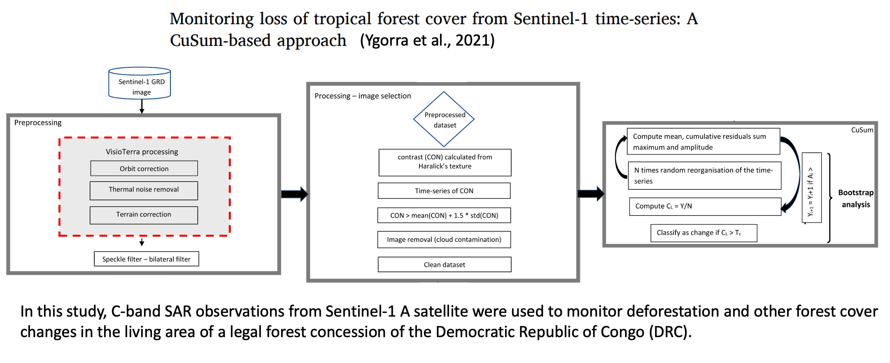

# A case study

## Burned area detection

A workflow based on Sentinel-1 SAR data and open-source algorithms for unsupervised burned area detection in Mediterranean ecosystems

Written by De Luca, Silva and Modica (2021).

## De Luca's paper aim

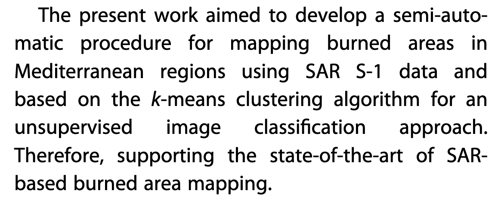

## The study area
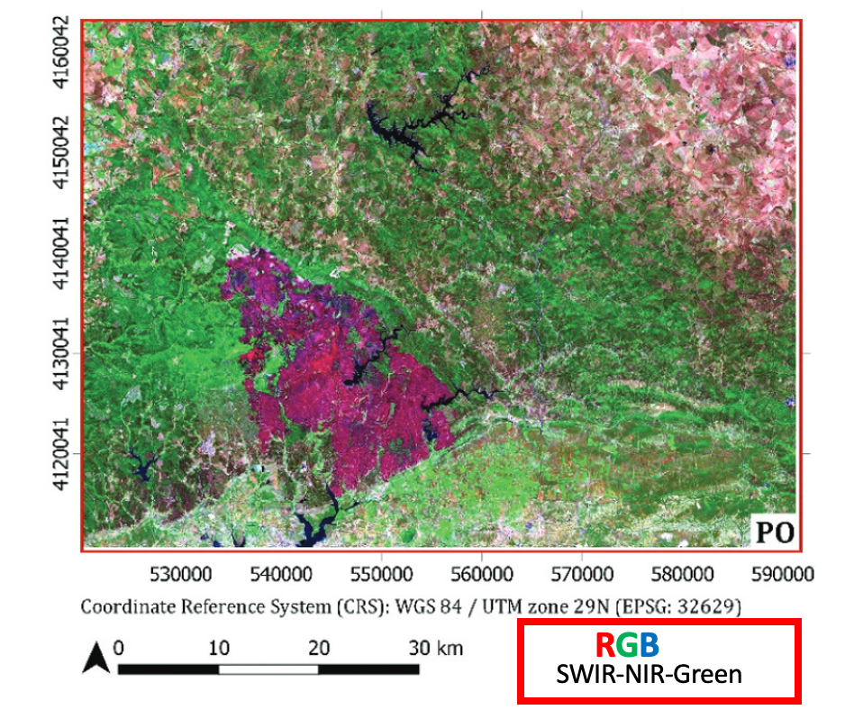

## The data

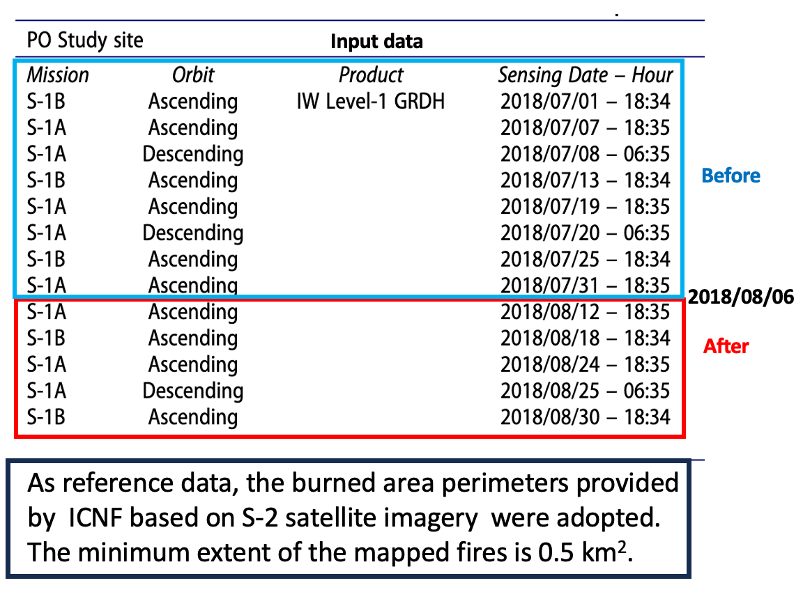

## The workflow 
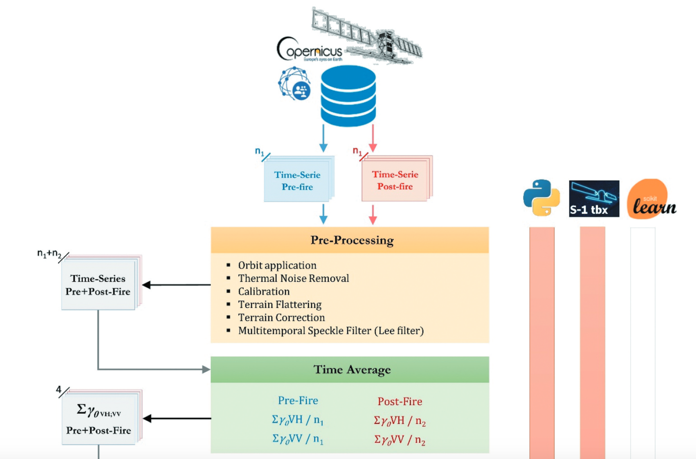

## The workflow ...

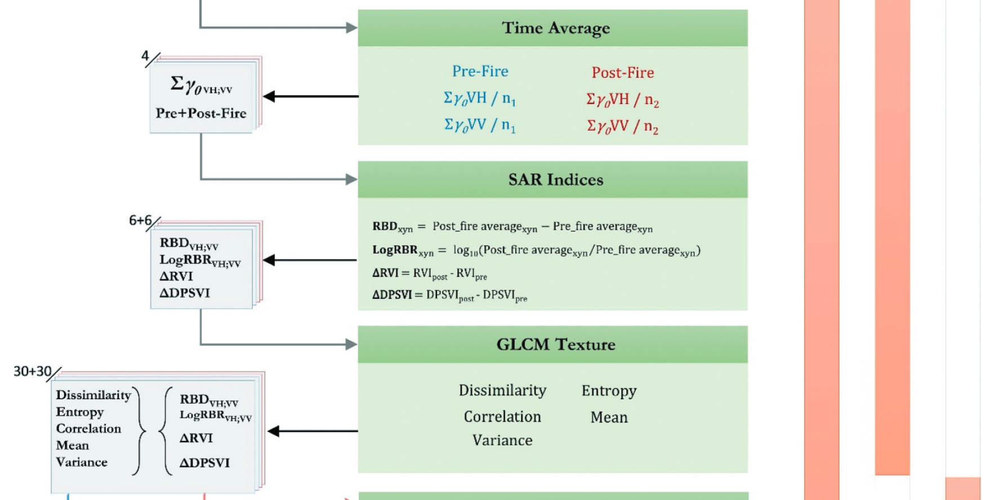

## The workflow ...

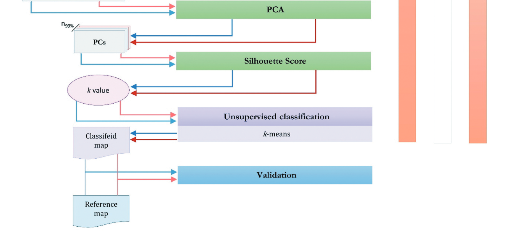

## The software

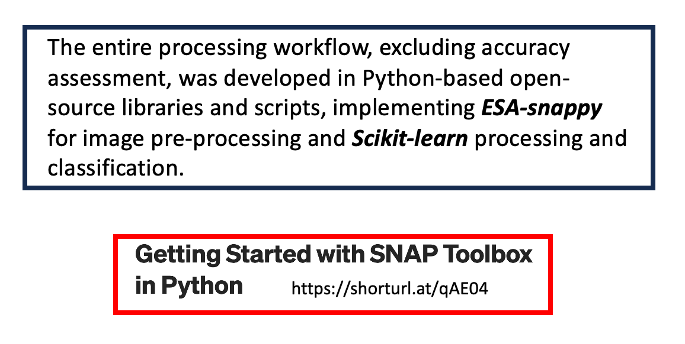

## The radar indices ...

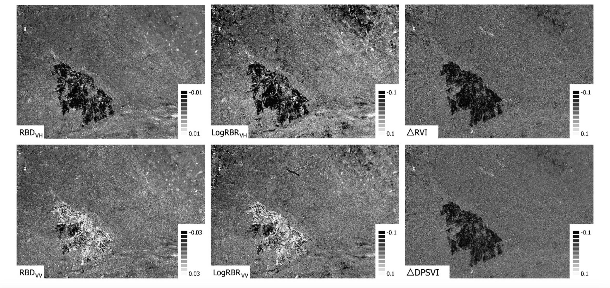

## The unsupervised classification

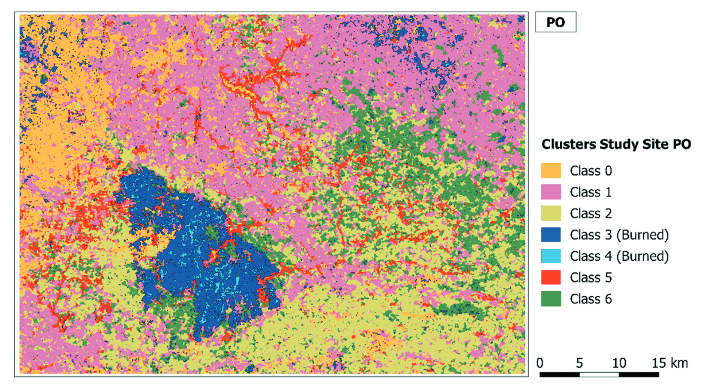

## Classes separation

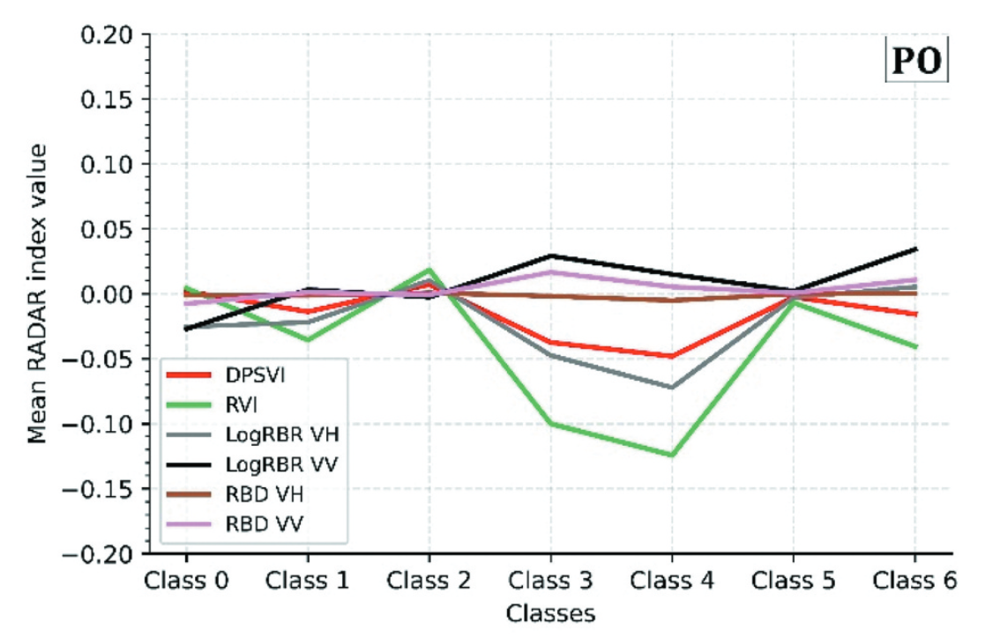

## Classes separation

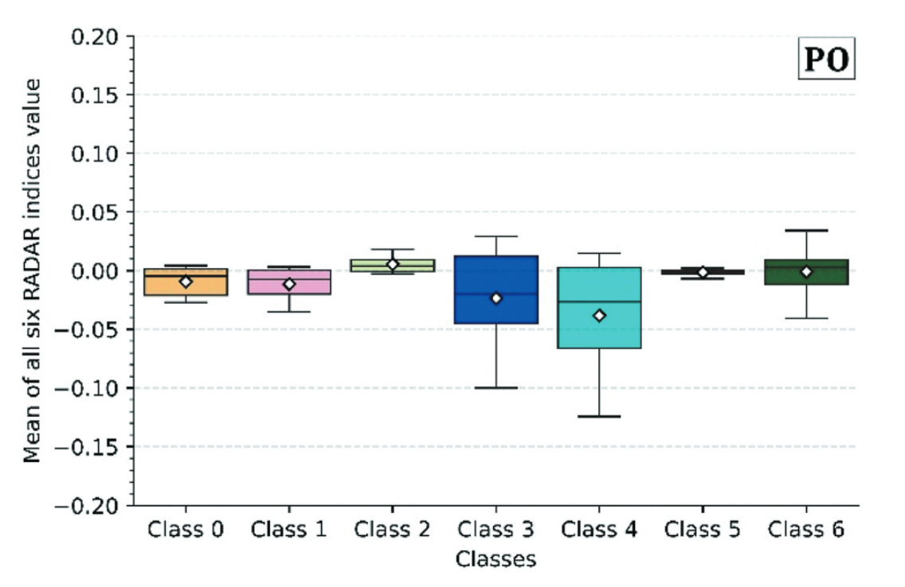

## Thematic accuracy

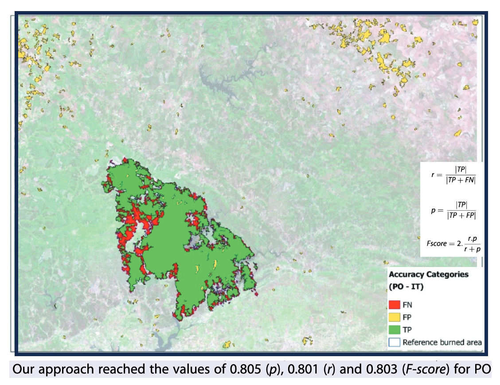

## Additional info

##### The SAR workflow's paper is available [here](https://www.tandfonline.com/doi/full/10.1080/15481603.2021.1907896)

## Reproducible workflows

- [Portable and scalable workflows for earth observation data analysis with Nextflow](https://depositonce.tu-berlin.de/bitstreams/8407efec-7759-40d9-97a9-ff86f630b6a3/download)

- [Rangeland classification](https://seqera.io/pipelines/rangeland--nf-core/)

# To do before next class 

## Read this document

[A Review on PolSAR Decompositions](https://drive.google.com/file/d/1Q0Yz5TOyUgqfwHLFUiQMY6L-wJIpACR5/view?usp=sharing())

## Watch this video

[Answer pressing questions on our world](https://www.iceye.com/vos-talk4-video-page) 

Tom Ager (2023)

## Go back home

[The way home](page.qmd)

